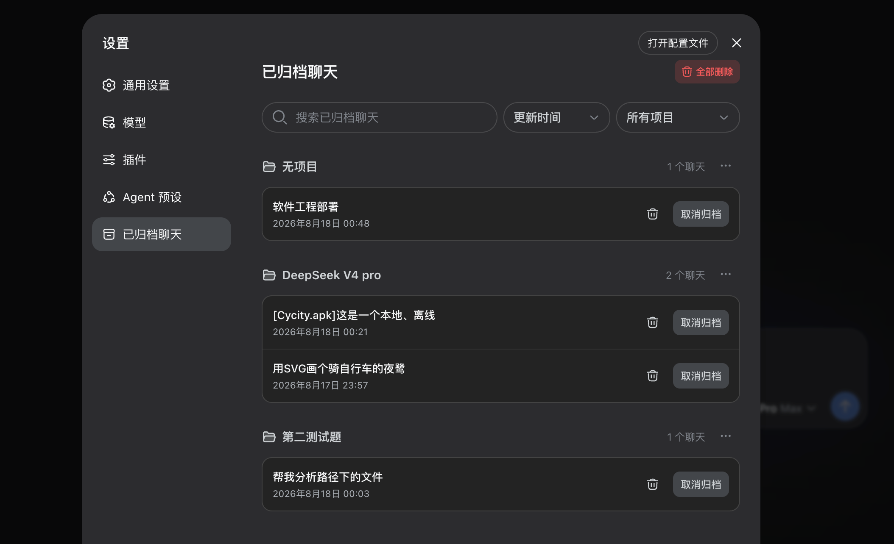

# DSH Archive Manager

English | [中文](README.zh.md)

DSH Archive Manager adds a complete archive workspace to the DeepSeek Harness Web profile. It gives you one place to find archived chats, browse them by project, restore them, or permanently remove their local session files.



## What It Does

- Adds **Archived chats** to **Settings** in DSH Web.
- Groups archived chats by project/workspace, with a separate group for chats that are not assigned to a project.
- Replaces workspace deletion with workspace archiving: the workspace and all of its chats keep their original project relationship in the archive.
- Restores an archived workspace together with its chats. If the original directory is unavailable, the archive remains visible as an unavailable project and can be restored to a directory selected by the user.
- A restore to a different directory keeps the archived chats attached to the selected workspace and shows a red in-page warning that the changed working directory may prevent some chats from continuing normally.
- Searches archived chats by title, working directory, project, or session ID.
- Filters the list by project.
- Sorts chats by updated time, created time, or alphabetical order.
- Restores a chat with **Unarchive**.
- Permanently deletes an individual chat and its local session log.
- Deletes every archived chat in a project from the project actions menu.
- Permanently deletes all archived chats with the **Delete all** action in the upper-right corner.
- Automatically cancels and releases any live session as soon as it becomes archived, so archived chats do not remain attached to the current process.
- Refuses to archive a chat while its Agent is genuinely running. Workspace archiving is also refused when any session in that workspace is genuinely running; an idle or merely attached session does not block archiving.
- Uses confirmation dialogs before destructive actions.
- Follows DSH's light and dark themes and its existing visual language.

## Safety And Compatibility

- The plugin is independent and loosely coupled. It does not modify DSH core packages. You can disable or remove it without making DSH Web unusable.
- Archived chats are not deleted automatically. They stay recoverable until you unarchive or permanently delete them.
- When an archived chat still has a running turn or is attached to an Agent, deletion first cancels the turn and releases its current-process attachment, then removes the session file.
- Before deleting a file, the plugin checks the session identity, file location, and file type. If a session cannot be verified safely, it is left untouched and the reason is shown in the page.
- After a successful deletion, related workspace records and local indexes are cleaned up.
- Permanent deletion currently supports DSH's default local JSONL storage. Other storage backends are refused safely rather than guessed at.
- During bulk deletion, entries that fail a safety check remain available and are reported; successfully deleted entries are removed.
- The plugin does not upload chat content or use an external service. Session data remains on your machine.
- Tested with DSH Web `0.1.1-rc.2`. The client icons are bundled by this plugin, so the release does not depend on the UI primitives package that is absent from the current Web profile. If a future DSH release changes its session or workspace interfaces, install a plugin release that explicitly supports it.

## Install From GitHub

Install directly from the public repository:

```sh
dsh plugin --profile web add github:MeSun424/dsh-archive-manager
```

Restart the DSH Web profile after installation. Then open **Settings > Archived chats**.

## Install From A Local Checkout

This is useful when installing a downloaded source archive or testing a local build. Node.js and npm are required to create the package:

```sh
git clone https://github.com/MeSun424/dsh-archive-manager.git
cd dsh-archive-manager
npm install
npm run pack:local
dsh plugin --profile web add file:"$PWD/dsh-archive-manager-0.1.2.tgz"
```

Restart DSH Web after installation.

## Update Or Reinstall

Install the newer GitHub revision or local package with the same `add` command, then restart DSH Web. If your DSH installation reports that the package is already present, remove it first and run the install command again:

```sh
dsh plugin --profile web remove dsh-archive-manager
dsh plugin --profile web add github:MeSun424/dsh-archive-manager
```

Removing or reinstalling the plugin does not delete your archived chats or session files.

## Disable Or Uninstall

To disable the plugin temporarily, turn off `dsh-archive-manager` in the DSH plugin manager, if your DSH build provides a disable toggle. Restart DSH Web after changing plugin state.

To remove it from the Web profile:

```sh
dsh plugin --profile web remove dsh-archive-manager
```

Uninstalling the plugin leaves DSH core and your remaining chat data intact. It also does not restore chats that you already deleted permanently.

## License

MIT
