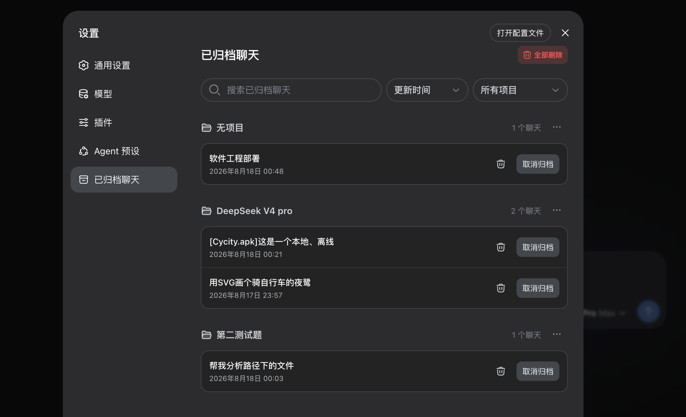

# DSH 归档管理插件

[English](README.md) | 中文

DSH 归档管理插件为 DeepSeek Harness 桌面版和 Web 版增加完整的归档管理页面。你可以在一个位置按项目查看已归档聊天、搜索和筛选内容、恢复聊天，或永久删除本地会话文件。



## 功能

- 在 DSH 的 **设置** 中增加 **已归档聊天**。
- 按项目/工作区分组显示归档聊天；没有所属项目的聊天会单独归组。
- 将工作区删除改为工作区归档：工作区及其全部聊天会保留原项目关系，一并进入归档管理。
- 取消归档工作区时连同聊天一起恢复。原目录不可用时，归档页会保留一个不可用的虚拟项目，并允许重新选择目录尝试恢复。
- 选择其他目录恢复仅改变项目归属，不迁移原会话的工作目录和文件。继续对话可能仍使用原目录；优先在原目录恢复。
- 按标题、工作目录、项目名称或会话 ID 搜索。
- 按项目筛选。
- 按更新时间、创建时间或字母顺序排序。
- 使用 **取消归档** 恢复单条聊天。
- 永久删除单条聊天及其本地会话日志。
- 通过项目操作菜单删除某个项目中的全部归档聊天。
- 使用右上角的 **全部删除** 永久删除所有归档聊天。
- 对话进入归档后会自动取消运行回合并释放当前进程挂载，避免归档聊天继续显示为运行中。
- 当前 Agent 运行中，或宿主报告仍有后台任务、子智能体等活动时禁止归档；先停止任务，再执行归档。仅“已挂载”或界面残留状态不会阻止归档。
- 所有删除操作都需要确认。
- 自动清理已经脱离所有工作区的空壳会话，避免首页「未分组」里留下只有 ID 的空白聊天。
- 自动适配 DSH 的浅色和深色主题，并沿用 DSH 的界面风格。

## 项目特点与兼容性

- 插件独立、松耦合，不修改 DSH 核心包。停用或卸载插件不会影响 DSH Web 核心功能。
- 归档聊天会一直保留，直到你主动取消归档或永久删除。
- 如果归档聊天仍有运行回合或仍挂载在 Agent 上，删除时会先强制取消回合并释放当前进程中的挂载，再删除会话文件。
- 删除文件前会校验会话身份、文件位置和文件类型。无法安全确认的会话会保留原状，并在页面中显示原因。
- 删除成功后会同步清理相关的 Workspace 记录和本地索引。
- 已经不属于任何工作区的空壳会话会自动清理，避免再次出现在「未分组」中。仍有对话内容的会话不会被删除。
- 永久删除目前面向 DSH 默认的本地 JSONL 存储。遇到其他存储后端时，插件会安全拒绝删除，不会猜测路径或强行操作。
- 批量删除时，未通过安全检查的条目会保留并显示原因；通过检查的条目会正常删除。
- 项目删除会包含被搜索隐藏的归档聊天，确认框显示实际数量。不会删除该项目的未归档聊天或项目文件。
- 若日志已经删除但归档索引更新失败，会明确提示重试以完成清理。
- 空项目归档后也能从项目菜单恢复。暂时无法读取日志不会自动删除归档记录。
- 插件不会上传聊天内容，也不依赖外部服务；会话数据始终保留在本机。
- 已验证 DeepSeek Harness 桌面版 `0.2.0-rc.2`。适配新版插件通信协议、V4 会话日志和跨进程写入锁；归档会同步取消聊天置顶，并检查后台任务和子智能体活动。桌面版沿用 Web 客户端插件接口，因此同一份插件也可用于 Web。
- 保留对 DSH Web `0.1.2-alpha.1`、`0.1.2-alpha.2`、`0.1.2-rc.1` 和 `0.1.5-rc.1` 的支持。RC 版本通过可选的 `uiWorkspace` 服务提供目录选择；插件会在该服务可用时使用它，并在旧版中回退到 `workspaces.pickDirectory()`。会话列表、读取和永久删除会走当前持久化句柄接口，并保留旧版原始日志读取作为回退。客户端图标由插件自行打包，因此不依赖特定版本的宿主图标包。若未来 DSH 改动会话或 Workspace 接口，请使用明确支持该版本的插件版本。

## 安装到桌面版

先完全退出 DeepSeek Harness 桌面版，再使用桌面版自带的 `dsh` 安装插件：

```sh
dsh plugin --profile desktop add github:MeSun424/dsh-archive-manager
```

如果没有将桌面版的 `dsh` 加入 PATH，macOS 可以直接使用：

```sh
"/Applications/DeepSeek Harness.app/Contents/Resources/runtime/cli/bin/dsh" plugin --profile desktop add github:MeSun424/dsh-archive-manager
```

本地源码打包后，将上面命令中的 GitHub 地址换成安装包的绝对路径，例如 `file:/path/to/dsh-archive-manager-0.2.1.tgz`。不要为安装桌面插件另装 npm 全局 CLI。

重新打开桌面版，然后进入 **设置 > 已归档聊天**。更新、移除桌面插件时同样使用 `--profile desktop`；操作前先完全退出桌面版。卸载命令是 `dsh plugin --profile desktop remove dsh-archive-manager`，不会删除聊天数据。

## 安装到 Web 版

直接从公开仓库安装：

```sh
dsh plugin --profile web add github:MeSun424/dsh-archive-manager
```

安装完成后重启 DSH Web，然后打开 **设置 > 已归档聊天**。

## 从本地源码安装

适用于下载源码后安装或测试本地构建。打包需要 Node.js 和 npm：

```sh
git clone https://github.com/MeSun424/dsh-archive-manager.git
cd dsh-archive-manager
npm install
npm run pack:local
dsh plugin --profile web add file:"$PWD/dsh-archive-manager-$(node -p "require('./package.json').version").tgz"
```

安装完成后重启 DSH Web。

## 更新或重新安装

使用同一个 `add` 命令安装新的 GitHub 版本或本地安装包，然后重启 DSH Web。如果 DSH 提示插件已经存在，可以先移除旧版本，再重新安装：

```sh
dsh plugin --profile web remove dsh-archive-manager
dsh plugin --profile web add github:MeSun424/dsh-archive-manager
```

移除或重新安装插件不会删除已有的归档聊天或会话文件。

## 停用或卸载

如果你的 DSH 版本提供插件管理器开关，可以在插件管理器中关闭 `dsh-archive-manager` 来暂时停用插件。修改插件状态后请重启 DSH Web。

要从 Web profile 中卸载插件：

```sh
dsh plugin --profile web remove dsh-archive-manager
```

卸载不会影响 DSH 核心功能和仍保留的聊天数据；已经永久删除的聊天也不会因为卸载而恢复。

## 许可证

MIT
